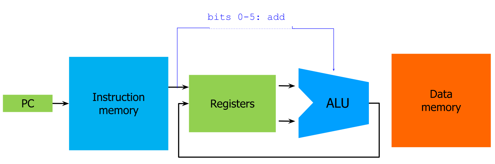

# {Architectures}{13:00}{17/10/23}{Tamer Elboghdadly}

## ISA (Instruction Set Architectures)

- The ISA of a processor defines the logical view of the processor
- This is what defines how machine code for a specific processor should be written or generated
- Includes both the set of instructions supported by the processor and the number and types of register available

## RISC (Reduced Instruction Set Computing)

- A RISC architecture is one which has a much less complex ISA than x86 (known as Complex Instruction Set Computing or CISC)
- There are many different RISC architectures, such as MIPS, ARM, RISC-V, PowerPC, SPARC, etc
- The main differences between RISC and CISC architectures are
  - All RISC instructions are the same length, with uniform encoding (MIPS-32 instructions are all 4 bytes or 32 bits long), whereas x86 instructions can be any length
  - RISC processors have many general purpose registers (MIPS has 32, x86 only has 5 or 6)
  - All RISC arithmetic instructions operate on values in registers, rather than in memory
  - RISC only has a limited number of addressing modes
- Since RISC only contains a limited number of instructions, it is much easier to make each of them execute much faster and more efficiently
- The small number of instructions also makes it much easier to develop compilers and assemblers for the architecture
- As every RISC instruction is in the same format, ILP (Instruction Level Parallelism) is much easier to implement
- Some CISC instruction sets include a set of (effectively) RISC instructions for more commonly used instructions, so they can use ILP more effectively

## MIPS (Microprocessor without Interlocked Pipeline Stages)

- MIPS is a type of RISC architecture
- The ISA for a MIPS processor is much less complex than that of an x86 CPU
- MIPS is still used in a small number of embedded systems, but most low-power or mobile devices use ARM processors
- There are 32 general-purpose registers, so only 5 bites are needed to identify a register
- Every arithmetic operation involve three registers, for example
  - add $t0, $s1, $s2
  - This takes the value from s2, adds it to s1 and stores the result in t0
- There are 3 formats which a MIPS instruction could use
  - R-format - 0-5: Opcode, 6-10: Source Register, 11-15: Second Source Register, 16-20: Result Register, 21-26: Shift Amount, 27-31: Function
  - I-format - 0-5: Opcode, 6-10: Source Register, 11-15: Second Source Register, 16-31: Immediate Address
  - J-format - 0-5: Opcode, 6-31: Address
- For the instruction `add $t0,$s1,$s2`, this diagram shows the path of data flow
